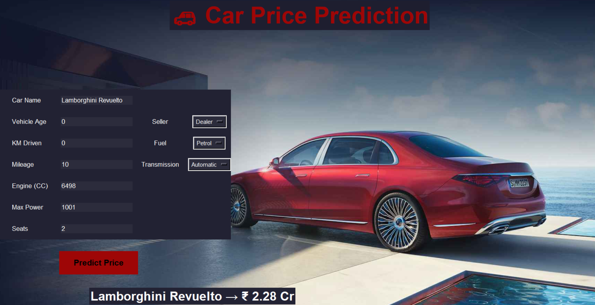

# 🚗 Car Price Prediction Using Machine Learning

Car Price Prediction is an end-to-end Machine Learning application developed to estimate the market value of used cars based on various vehicle characteristics. The system utilizes historical car data and a trained Random Forest Regression model to predict car prices accurately.

The project follows a complete machine learning workflow, including data preprocessing, feature scaling, model training, model persistence, and deployment through an interactive graphical user interface built with Python Tkinter. Users can provide information such as vehicle age, kilometers driven, mileage, engine capacity, maximum power, number of seats, fuel type, transmission type, and seller type to obtain an estimated selling price instantly.

The trained Random Forest model and scaler are stored separately and loaded using Pickle, enabling efficient real-time predictions. The application also formats predicted values in Lakhs and Crores, making the output easier to interpret.

## Key Features

* End-to-End Machine Learning Pipeline
* Random Forest Regression-based Price Prediction
* Data Preprocessing and Feature Scaling
* Model Persistence using Pickle
* Interactive GUI developed with Tkinter
* Real-Time Price Estimation
* Support for Multiple Fuel Types and Transmission Modes
* User-Friendly Interface with Image Background
* Organized Project Structure for Scalability and Maintenance

## Technologies Used

### Programming Language

* Python

### Libraries and Frameworks

* NumPy
* Pandas
* Matplotlib
* Seaborn
* Plotly
* Scikit-learn
* Tkinter
* Pillow (PIL)
* Pickle

### Development Tools

* Jupyter Notebook
* VS Code

## Machine Learning Model

*Linear Regression / Random Forest (whichever you used)
*Train-test split for evaluation
*Model evaluation using MAE / MSE / R² Score

## Project Workflow

1. Data Collection
2. Data Preprocessing
3. Exploratory Data Analysis (EDA)
4. Feature Scaling
5. Model Training using Random Forest Regressor
6. Saving Model and Scaler
7. Building GUI with Tkinter
8. Real-Time Car Price Prediction

## Applications

* Used Car Dealerships
* Vehicle Valuation Systems
* Automobile Marketplaces
* Data-Driven Pricing Solutions
* Car Resale Platforms

## Conclusion

This project demonstrates the practical implementation of Machine Learning and Python GUI development for solving real-world vehicle pricing problems. By integrating data analysis, feature engineering, Random Forest Regression, and a Tkinter-based interface, the system provides an efficient and user-friendly solution for predicting used car prices.

